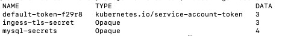

# Deploy MySql To Minikube

## Deploy MySQL to minikube

You can deploy a MySQL instance to Kubernetes via yaml configuration files easily. 

### 1.	Create persistent volume claim: (save below content as file named “persistentVolumeClaim.yaml”)
```
---
apiVersion: v1
kind: PersistentVolumeClaim
metadata:
  name: mysql-data-disk
spec:
  accessModes:
    - ReadWriteOnce
  resources:
    requests:
      storage: 1Gi
```
Execute the command at terminal 	`kubectl apply -f persistentVolumeClaim.yaml`
<br /><br />
Check the entity:<br />
`kubectl get pvc`


<br />
 
### 2.	Create secrets (password): (save below content as file named “secrets.yaml”) 

```
---
apiVersion: v1
kind: Secret
metadata:
  name: mysql-secrets
type: Opaque
data:
  ROOT_PASSWORD: bXktc3VwZXItc2VjcmV0LXBhc3N3b3JkCg==
```

Execute the command at terminal 		`kubectl apply -f secrets.yaml`
<br /><br />
Check the entity:<br />
`kubectl get secrets`
 
<br /><br />
(Password is base64 for my-super-secret-password)<br /><br />
`Mehmets-MacBook-Pro:itx-mysql-restapi mehmetcambaz$ echo my-super-secret-password | base64
bXktc3VwZXItc2VjcmV0LXBhc3N3b3JkCg==`

### 3.	Create deployment: (save below content as file named “deployment.yaml”) 

```
apiVersion: apps/v1
kind: Deployment
metadata:
  name: mysql-deployment
  labels:
    app: mysql
spec:
  replicas: 1
  selector:
    matchLabels:
      app: mysql
  template:
    metadata:
      labels:
        app: mysql
    spec:
      containers:
        - name: mysql
          image: mysql:5.7
          ports:
            - containerPort: 3306
          volumeMounts:
            - mountPath: "/var/lib/mysql"
              subPath: "mysql"
              name: mysql-data
          env:
            - name: MYSQL_ROOT_PASSWORD
              valueFrom:
                secretKeyRef:
                  name: mysql-secrets
                  key: ROOT_PASSWORD
      volumes:
        - name: mysql-data
          persistentVolumeClaim:
            claimName: mysql-data-disk
```
<br />

Execute the command at terminal         `kubectl apply -f deployment.yaml`

<br />
Check the entity:<br />

`kubectl get pods`


 
<br />

### 4.	Expose deployment as service: (save below content as file named “service.yaml”) 

```
kind: Service
apiVersion: v1
metadata:
  name: mysql-service
spec:
  ports:
    - protocol: TCP
      port: 3306
      targetPort: 3306
      nodePort: 30062
  selector:
    app: mysql
  clusterIP: 10.103.236.137
  type: NodePort
  sessionAffinity: None
  externalTrafficPolicy: Cluster
status:
  loadBalancer: {}
```

Execute the command at terminal 		`kubectl apply -f service.yaml`

<br />
Check the entity:<br />

`kubectl describe service mysql-service`
<br />

 


